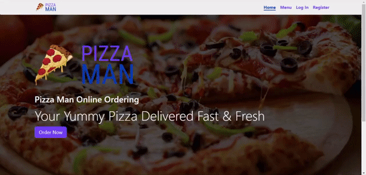

# Pizza-Man

A website for ordering your favourite Pizza Online.


## Demo

<div align="center">
    
</div>

**NOTE:** The features shown in the demo is not exhaustive. Only the core features are showcased in the demo.

## Tools used

1. React: To create the Single Page App
2. React-Router: For Routing
3. Redux: For State Management
4. Firebase: As a DataBase


# Screen shot of the web application


## Firebase Setup

You need to create a firebase configeration file holding the firebase settings in the path `/src/firebase/config.js`. The required format is:

```javascript
const firebaseConfig = {
	apiKey: "API-KEY",
	authDomain: "AUTH-DOMAIN.firebaseapp.com",
	databaseURL: "DATABASE-URL.firebaseio.com",
	projectId: "PROJECT-ID",
	storageBucket: "STORAGE-BUCKET.appspot.com",
	messagingSenderId: "MESSAGING-SENDER-ID",
	appId: "APP-ID",
	measurementId: "MEASUREMENT-ID",
};

export default firebaseConfig;
```


